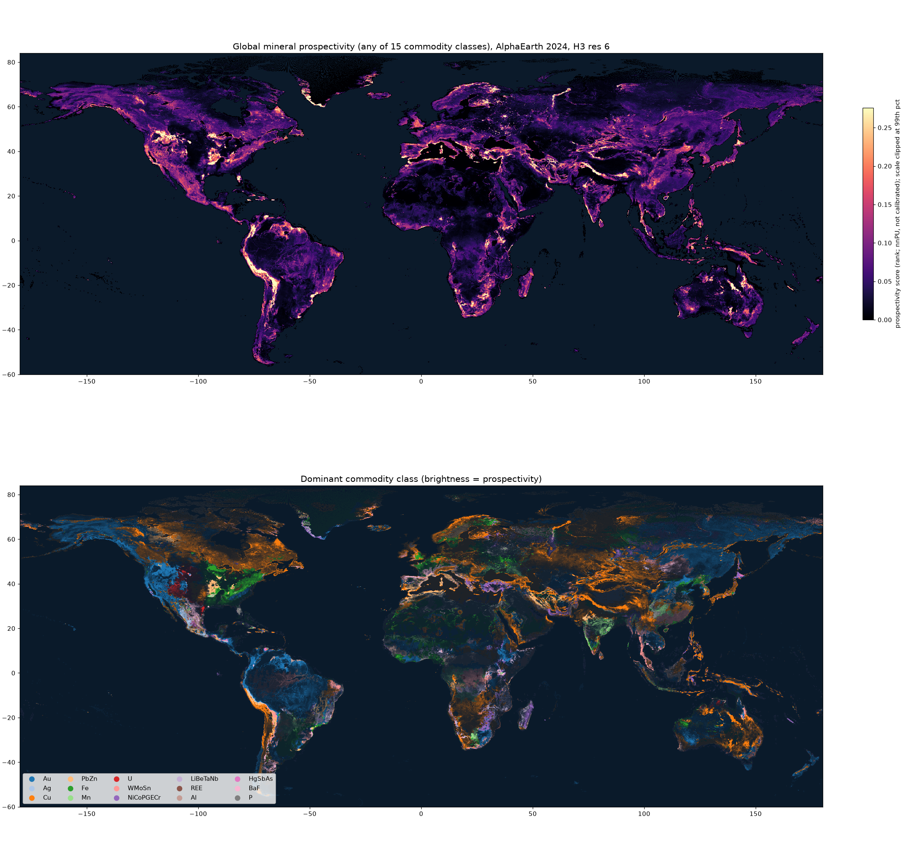

# earthprosp

**Mineral prospectivity for every land cell on Earth from AlphaEarth Foundations (AEF)
satellite embeddings.** Each of **4,489,547** H3 res-6 cells (~36 km²) gets a split
`[P(none), P(Au), P(Cu), P(PbZn), …]` across 15 commodity classes. The model has a
positive-unlabeled presence head and a composition head on top of frozen AEF embeddings.

* **Global table:** [`outputs/global/earthprosp_global_res6.parquet`](outputs/global/earthprosp_global_res6.parquet) (38.6 MB; decode with `earthprosp.io.read_compact`)
* **Interactive explorer:** `outputs/global/explorer.html` (open locally)
* **Design, validation and caveats:** [docs/DESIGN.md](docs/DESIGN.md)



## Headline numbers (global, v2)

| test | distance to known deposits | **AEF model** |
|---|---|---|
| Spatial CV (600,000 km² blocks): world-class deposits in top 20% of land | 40% | **56%** (GBM 62%) |
| Spatial CV: deposits outside the US in top 20% of land | 43% | **61%** |
| Africa hidden from training: world-class capture AUC | 0.39 | **0.79** |
| Australia hidden from training: world-class capture AUC | 0.44 | **0.77** |
| South America hidden from training: world-class capture AUC | 0.54 | **0.69** |

The first global model learned "looks like the US" (44% of the global top 5% of land sat in the US).
Label-propensity reweighting and one global labelling standard cut that to 15%. The commodity
split is reliable near known deposits and falls back toward the global mix far from them.
Urban land and bare rock are the main false-positive modes. See DESIGN.md.

A western-US pilot with per-pixel bag models is in `outputs/westus/`.

## Layout

```
earthprosp/
  global_agg.py   streaming, resumable global AEF -> per-cell statistics
  io.py           decode the compact global table
  aef.py          read AEF COGs (public Source Cooperative mirror) at overview level -> per-cell pixel bags
  labels.py       USGS MRDS -> per-cell composition / confidence
  commodities.py  15-class commodity taxonomy, dev-status weights
  grid.py         H3 helpers, spatial blocks, country masks
  features.py     bag statistics, neighbourhood context
  model.py        PixelAdapter + GatedAttentionPool + presence/composition heads, nnPU loss
  pretrain.py     self-supervised (SimCLR over sub-bags) adaptation
  train.py        fit / predict / spatial folds
  evaluate.py     capture (success-rate) and composition metrics
  synthetic.py    planted-signal data for tests
scripts/
  fetch_aef.py    bbox or --global fetch -> data/*.npz
  run_pilot.py    spatial CV of baselines vs. NN
  predict_map.py  final model -> split.parquet + map.png (pilot)
  fetch_global.py all 34k AEF COGs -> per-cell stats (32 min)
  run_global.py   global labels, propensity weighting, spatial CV + continent hold-outs, final split
  global_report.py maps, country tables, greenfield candidates, res-4 aggregate
  export_compact.py / build_explorer.py   committed table and interactive page
```

## Reproduce

```bash
pip install -r requirements.txt
mkdir -p data
curl -L https://mrdata.usgs.gov/mrds/mrds-csv.zip -o data/mrds.zip && unzip -o data/mrds.zip -d data
curl -L https://raw.githubusercontent.com/nvkelso/natural-earth-vector/master/geojson/ne_50m_admin_0_countries.geojson -o data/ne_countries.geojson
python scripts/fetch_aef.py --bbox -125 31 -102 49 --year 2024 --out data/westus_2024.npz   # ~1 min
python scripts/run_pilot.py --bags data/westus_2024.npz --country USA --out outputs/westus --epochs 15 --pretrain-epochs 5   # ~75 min on 4 CPUs
python scripts/predict_map.py --bags data/westus_2024.npz --train-country USA --out outputs/westus
pytest -q
```

AEF data: "The AlphaEarth Foundations Satellite Embedding dataset is produced by Google
and Google DeepMind." (CC-BY 4.0), via the Source Cooperative mirror `tge-labs/aef`.
