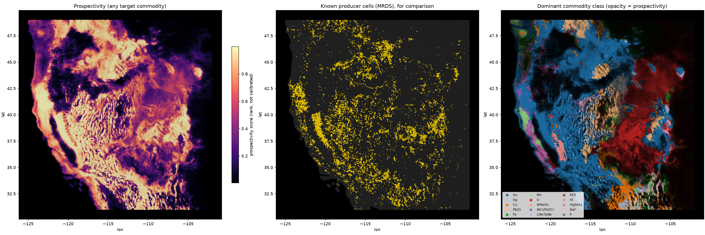

# earthprosp

Exploring **global mineral prospectivity from AlphaEarth Foundations (AEF) satellite
embeddings**. The model assigns every H3 grid cell a split
`[P(none), P(Au), P(Cu), P(PbZn), …]` across 15 commodity classes, using frozen AEF
embeddings, a trainable adapter with attention pooling, a positive-unlabeled
presence head and a composition head.

See **[docs/DESIGN.md](docs/DESIGN.md)** for the full design, trade-offs and results.



## Headline (western US pilot, spatial 5-fold CV, 88k H3 res-6 cells)

| model | capture of held-out deposits in top 20% area | capture AUC | composition top-1 |
|---|---|---|---|
| random | 0.20 | 0.50 | – |
| class prior (composition) | – | – | 0.38 |
| distance to known deposits (no AEF) | 0.36 | 0.65 | – |
| GBM on AEF stats + context | **0.53** | **0.76** | 0.47 |
| AEF adapter + MIL + PU/composition NN | 0.51 | 0.76 | **0.48** |

AEF clearly carries prospectivity signal. The fine-tuned NN matches a GBM on presence
and gives better-calibrated commodity splits. Part of the lift is likely AEF
recognising mine footprints; see DESIGN.md §"What this says".

## Layout

```
earthprosp/
  aef.py          read AEF COGs (public Source Cooperative mirror) at overview level -> per-cell pixel bags
  labels.py       USGS MRDS -> per-cell composition / confidence
  commodities.py  15-class commodity taxonomy, dev-status weights
  grid.py         H3 helpers, spatial blocks, country masks
  features.py     bag statistics, neighbourhood context
  model.py        PixelAdapter + GatedAttentionPool + presence/composition heads, nnPU loss
  pretrain.py     self-supervised (SimCLR over sub-bags) adaptation
  train.py        fit / predict / spatial folds
  evaluate.py     capture (success-rate) and composition metrics
  synthetic.py    planted-signal data for tests
scripts/
  fetch_aef.py    bbox or --global fetch -> data/*.npz
  run_pilot.py    spatial CV of baselines vs. NN
  predict_map.py  final model -> split.parquet + map.png
```

## Reproduce

```bash
pip install -r requirements.txt
mkdir -p data
curl -L https://mrdata.usgs.gov/mrds/mrds-csv.zip -o data/mrds.zip && unzip -o data/mrds.zip -d data
curl -L https://raw.githubusercontent.com/nvkelso/natural-earth-vector/master/geojson/ne_50m_admin_0_countries.geojson -o data/ne_countries.geojson
python scripts/fetch_aef.py --bbox -125 31 -102 49 --year 2024 --out data/westus_2024.npz   # ~1 min
python scripts/run_pilot.py --bags data/westus_2024.npz --country USA --out outputs/westus --epochs 15 --pretrain-epochs 5   # ~75 min on 4 CPUs
python scripts/predict_map.py --bags data/westus_2024.npz --train-country USA --out outputs/westus
pytest -q
```

AEF data: "The AlphaEarth Foundations Satellite Embedding dataset is produced by Google
and Google DeepMind." (CC-BY 4.0), via the Source Cooperative mirror `tge-labs/aef`.
